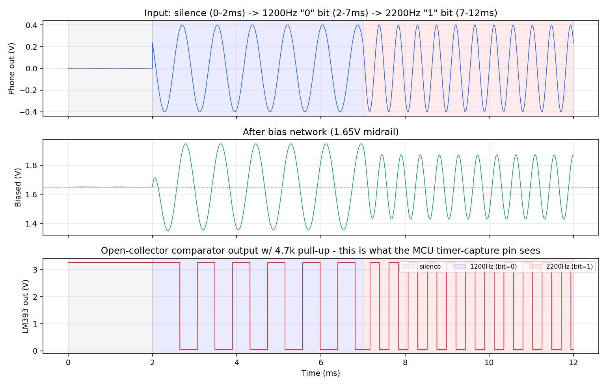

# Sovereign Mobility Controller — Audio-Jack AFSK Front End (v0.2)

**Status: simulated and verified in SPICE. Decoder firmware compiles clean
against real AVR silicon. Not yet bench-tested on physical hardware —
that's the next step, and it's where you come in.**

## What this is

A control-signal bridge that lets any phone — locked, proprietary, doesn't
matter — drive a wheelchair or mobility-assist controller through the one
analog I/O port that cannot be DRM'd: the headphone jack.

The phone runs the smart layer (AI assistant, route memory, voice
interface — whatever you want). It sends movement intent out as an audio
tone (Bell-202-style AFSK: 1200Hz / 2200Hz). A few dollars of commodity
parts decode that tone back into digital signal and hand it to a motor
controller that never trusts it blindly.

**Why it matters:** powered mobility hardware for disabled users is
almost universally proprietary-locked — the controller, the firmware,
sometimes even the ability to service your own chair. A remote kill
switch or an abandoned vendor shouldn't be able to leave someone
immobile. This is a sovereign, salvage-buildable alternative.

## What's working right now

- `afsk_frontend_v2.cir` — SPICE netlist, runs in ngspice. Models a real
  LM393 comparator (open-collector output, ~1.3us propagation delay,
  Schmitt-trigger hysteresis added to reject noise) — not an idealized
  comparator. Verified: decodes 1200Hz and 2200Hz tones to within 0.1Hz,
  zero false triggers during silence.
- `afsk_v2_simulation.png` — the actual simulation output. This is your
  reference: if your breadboard build doesn't look like this on a scope,
  something's off.


- `afsk_decoder.c` — bare-metal AVR C (no Arduino core, no libraries
  beyond avr-libc). Timer1 input-capture edge timing, 3-sample majority
  vote per bit, even-parity check, start-bit framing. Compiles to 762
  bytes flash / 25 bytes RAM on an ATmega328P — 2.3% / 1.2% of capacity.
- `afsk_decoder.hex` — flashable build of the above. `avrdude` it onto
  any ATmega328P you can find or salvage.

## Run the simulation yourself (no hardware required)

```
ngspice -b afsk_frontend_v2.cir
```

Generates the same waveform as `afsk_v2_simulation.png`. If you've got a
phone and want to test the real analog path before you have parts: any
tone-generator app set to 1200Hz or 2200Hz approximates the front end's
expected input — compare against the simulated bias/comparator stages.

## Build the firmware yourself

```
avr-gcc -mmcu=atmega328p -DF_CPU=16000000UL -DDECODER_STANDALONE_MAIN -Os -Wall -Wextra -std=c99 afsk_decoder.c -o afsk_decoder.elf
avr-objcopy -O ihex -R .eeprom afsk_decoder.elf afsk_decoder.hex
avrdude -c usbasp -p m328p -U flash:w:afsk_decoder.hex:i
```

## Bill of materials (front end only)

| Part | Qty | Notes |
|---|---|---|
| LM393 dual comparator | 1 | Decades-old, multi-source, ~$0.30 new. Pull from almost anything with analog sensing. |
| ATmega328P | 1 | Inside every Arduino Uno and a huge range of un-branded boards, 3D printer controllers, IoT junk. |
| 1µF film/ceramic cap | 1 | AC coupling |
| 100nF ceramic cap | 1 | Anti-alias filter |
| 47kΩ resistor | 2 | Bias network |
| 94kΩ resistor (or 2×47k parallel-adjusted) | 2 | Schmitt reference |
| 470kΩ resistor | 1 | Hysteresis feedback |
| 4.7kΩ resistor | 1 | Required pull-up (LM393 output is open-collector) |
| 1kΩ resistor | 1 | Anti-alias filter |

**Total: well under $2 in new parts. Likely $0 if salvaged** — every part
on this list is common enough to show up in dead electronics, old
appliance boards, or a junk bin at a hardware swap. See
[`SALVAGE.md`](SALVAGE.md) for specifics on where to find each part —
confirmed common sources vs. plausible-but-verify, with an issue
template for adding local sourcing tips (swap meets, thrift stores,
maker spaces) without cluttering the durable reference list.

## What's NOT done yet (honest status, not marketing)

- No bench/oscilloscope verification against real silicon — SPICE
  models are good but not perfect substitutes for a real part on a
  breadboard.
- No CAN-side handoff to the motor controller (Layer 1) yet — this repo
  is the audio-to-digital front end only.
- Frame-loss recovery is simple drop-and-resync, not yet hardened
  against extended noise bursts.

If you build this, hit a wall, or improve it — open an issue or a PR.
This is meant to be picked up and run with.

## License

Apache 2.0. Developed collaboratively with AI systems as part of the
authorship process — see Luke 10:7.

## Part of a larger effort

This is one piece of a Sovereign Mobility Controller architecture:
phone-side AI/intent layer → this audio-jack bridge → CAN-based motor
controller (real-time, independently-validated, fails safe to "dumb
joystick" if anything upstream goes dark). Related work: see
[paulstatchen10-ux](https://github.com/paulstatchen10-ux) for the
broader civic-tech ecosystem this fits into (MESA, Resilience Puck,
Community Relay Initiative).
